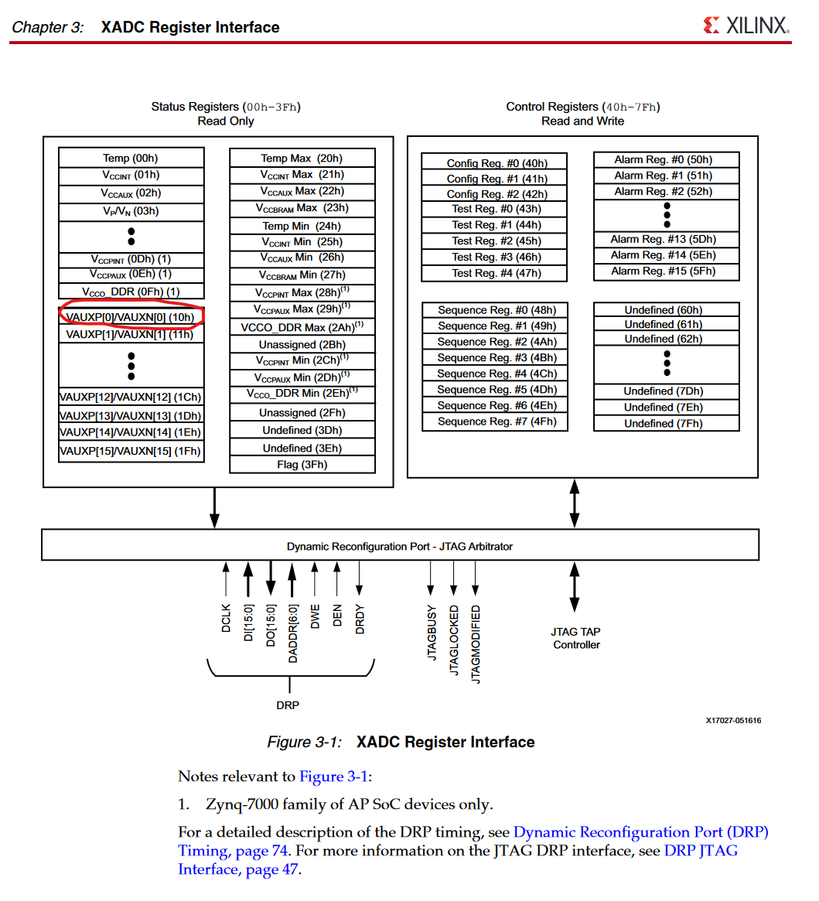

Designs for the XADC were created using Vivado 2020.1 version.

The register interface below shows why "DADDR" was set to 0x10 for ZC706 (used auxliarry channel 0) and 0x16 for Basys3 (used auxliary channel 6).

http://www.physics.umd.edu/hep/drew/programmable/ug480_7Series_XADC.pdf

