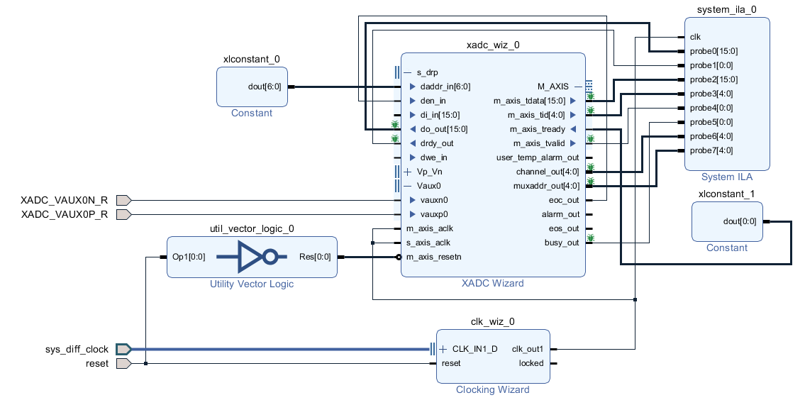

External multiplexer is enabled but not plugged in yet when this waveform was captured, so all channels are reading the same value.  

https://www.amazon.co.uk/DollaTek-CD74HC4067-Channel-Multiplexer-Breakout/dp/B07PPKRVGW/ref=sr_1_6

