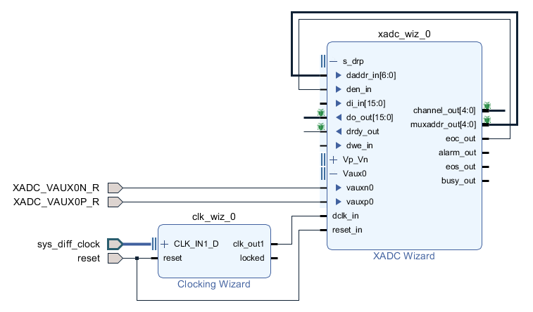
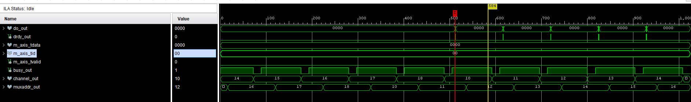
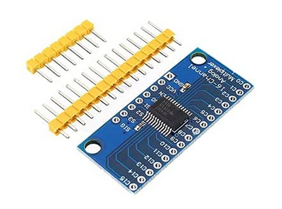
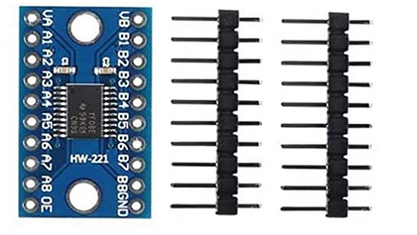
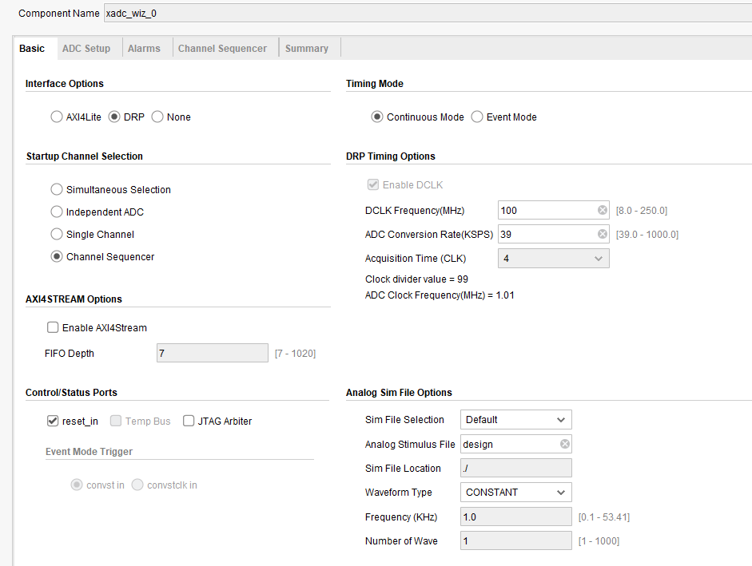
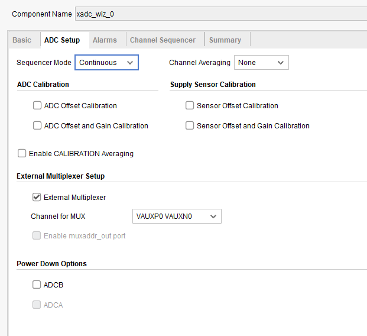
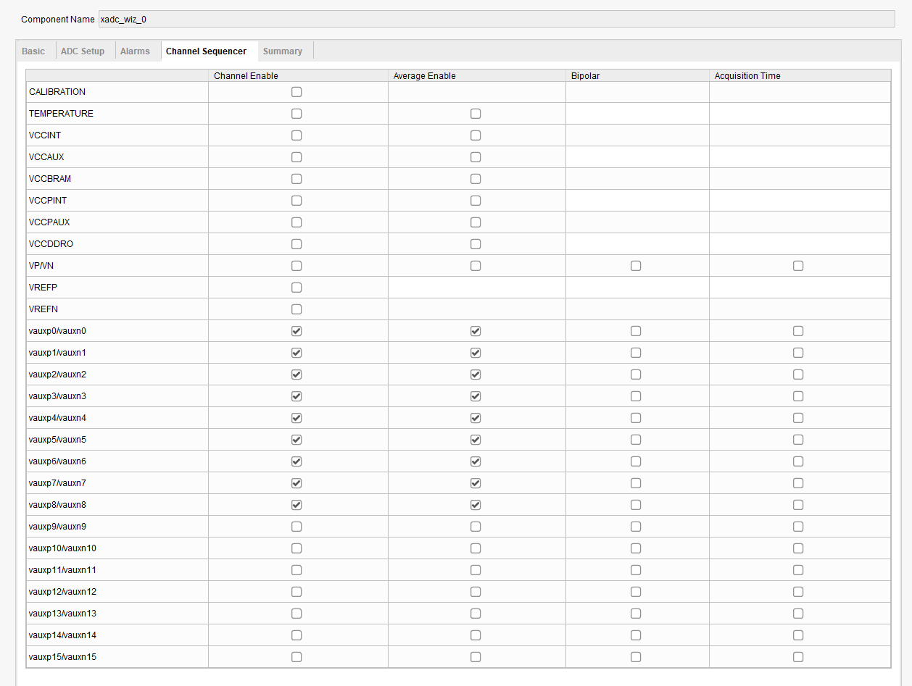
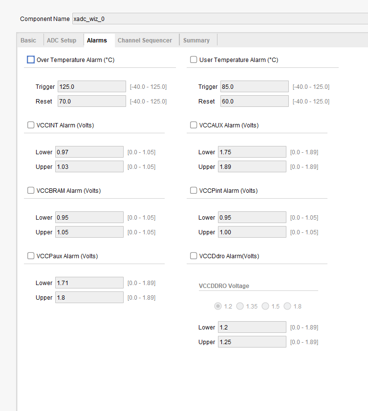
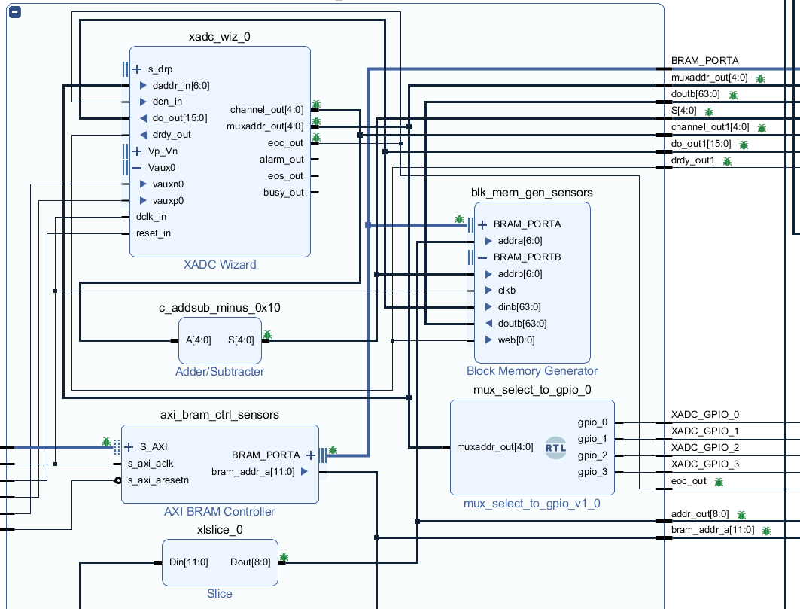

External multiplexer is enabled but not plugged in yet when this waveform was captured, so all channels are reading the same value.  

https://www.amazon.co.uk/DollaTek-CD74HC4067-Channel-Multiplexer-Breakout/dp/B07PPKRVGW/ref=sr_1_6

TXS0108E (HW221) logic level converter can be used to convert the 1.5V XADC GPIO output (used for mux select pins) to 3.3V or 5V for the multiplexer.
https://www.amazon.co.uk/XTVTX-TXS0108E-Converter-Bi-Directional-Compatible/dp/B09P87R16M/ref=sr_1_8

When using external multiplexer, I had issues when using high conversion rate (KSPS), changing it to 39 KSPS solved the issue (while using 50MHz clock).

  

  

  

  

Example use in a project is shown below. Lots of debug probes are outputted, but the circutry around xadc wizard isn't too compicated, subtraction is used to write the first sensor into the first location in memory (because xadc wizard keeps register of the first auxliary sensor at address 0x10, so 0x10 is subtracted).

